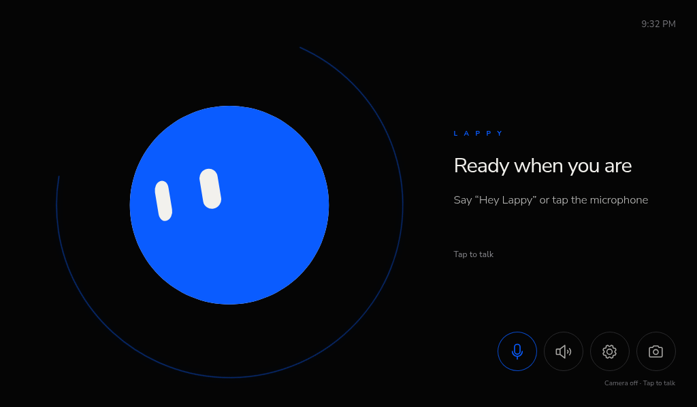

# Blobby — The AI Terminal For You

Blobby is a voice-first, full-screen ambient AI terminal for a Raspberry Pi 5
touch display. It combines the measured Bloub SVG animation engine with a
restrained Vue UI and a localhost-only Node service for conversation, settings,
and allow-listed hardware operations. The assistant that lives inside it is
named **Lappy**.



The application is usable with its safe mock gateway while the real gateway is
offline or undocumented. It does **not** claim that “Hey Lappy” works until a
compatible offline wake model is installed, and it reports unavailable physical
hardware honestly.

The reference-build inspection and hardware limitations are recorded in
[INSPECTION.md](INSPECTION.md). Emergency kiosk recovery is in
[RECOVERY.md](RECOVERY.md). More kiosk screenshots live in
[`artifacts/`](artifacts/).

## Architecture

```text
Chromium kiosk (Vue 3 + Bloub)
  ├─ explicit interaction state machine
  ├─ browser microphone capture, Gemini 3.5 transcription, and camera providers
  ├─ lazy, fully local eSpeak-NG WebAssembly TTS
  └─ WebSocket + same-origin HTTP
             │ localhost only
Node service (127.0.0.1:4318)
  ├─ typed mock/OpenAI-compatible gateway adapters
  ├─ validated settings store
  └─ allow-listed volume/brightness/application operations
```

The browser never receives unrestricted shell access. The local service invokes
only fixed executables with fixed argument shapes and no shell interpolation.
External text is rendered as Vue text, not injected HTML. Raw tool payloads,
hidden reasoning, prompts, credentials, and request bodies are never displayed
or logged.

## Current verified host

- Debian 13 on Raspberry Pi 5, labwc/Wayland, LightDM auto-login.
- 1024×600 HDMI touch display.
- HDMI output through PipeWire.
- USB UVC camera at `/dev/video0`.
- No enumerated microphone capture source.
- No Linux backlight device.
- A configured LAN Hermes gateway using its OpenAI-compatible streaming route;
  health, response streaming, and cancellation have been verified.

## Install dependencies and build

Node 22 and npm are already installed on the target Pi.

```bash
cd /home/terminal/Lappy
npm install
npm test
npm run build
```

The production command type-checks the Vue app, builds Vite assets, and compiles
the Node service. The current suite also runs the original Bloub engine tests.

## Development

Run the service and UI in separate terminals:

```bash
npm run dev:service
npm run dev -- --host 0.0.0.0 --port 4173 --strictPort
```

Open `http://127.0.0.1:4173/?dev=1`. The `dev=1` preview rail switches among
Idle, Listening, Thinking, Browser tool use, Speaking, Muted, Camera active, and
Error. The rail is excluded from normal production HTTP use.

Run a production preview:

```bash
npm run build
npm start
```

Then open `http://127.0.0.1:4318/`.

## Environment variables

Copy `.env.example` to `.env` and keep `.env` private.

| Variable | Purpose |
| --- | --- |
| `HERMES_GATEWAY_URL` | Gateway origin supplied by the existing gateway documentation |
| `HERMES_API_KEY` | Optional bearer credential, read only by the local service |
| `HERMES_AGENT_NAME` | Gateway model/agent identifier; defaults to `Lappy` |
| `HERMES_SESSION_ID` | Optional stable conversation/session identifier |
| `HERMES_ADAPTER` | `mock` or `openai`; defaults to mock when no gateway URL exists |
| `HERMES_CHAT_COMPLETIONS_PATH` | Explicit documented OpenAI-compatible streaming path |
| `HERMES_HEALTH_PATH` | Optional documented health path |
| `HERMES_RESPONSE_TIMEOUT_MS` | Stream inactivity deadline, clamped to 5 seconds–10 minutes; default 90 seconds |
| `WAKE_WORD_ENABLED` | Startup preference for the idle “Hey Lappy” listener |
| `WAKE_WORD_PROVIDER` | `local` enables the on-device Sherpa-ONNX listener; `unavailable` disables it |
| `CAMERA_ENABLED` | Initial camera preference; default false |
| `STT_PROVIDER` | `gemini`, `whisper`, or `browser`; `gemini` uses the dedicated Gemini 3.5 Transcribe model |
| `GEMINI_API_KEY` | Google Gemini API key for transcription and the optional wake listener; server-side only |
| `GEMINI_TRANSCRIBE_MODEL` | Defaults to the dedicated `gemini-3.5-transcribe` model |
| `TTS_PROVIDER` | `fish-audio`, `local-espeak`, or `browser`; resolved server-side without exposing secrets |
| `FISH_AUDIO_API_KEY` | Fish Audio bearer key; required for `fish-audio` and kept in the local service only |
| `FISH_AUDIO_VOICE_ID` | Fish Audio `reference_id`; configured for Lappy's selected voice |
| `FISH_AUDIO_MODEL` | Fish Audio model request header; configured as `s2.1-pro-free` |
| `LAPPY_HOST` / `LAPPY_PORT` | Local bind, default `127.0.0.1:4318` |
| `LAPPY_DEBUG_RECORDING` | Must remain false unless recordings are explicitly needed |

Never put secrets in a unit file, command line, screenshot, issue, or committed
environment file. The service does not print secret values.

## Gateway configuration

No gateway schema was present during initial inspection, so the project did not
guess endpoint paths. A later local `.env` supplied the existing gateway origin,
credential, and documented OpenAI-compatible paths. That configuration has now
passed health, streamed response, and cancellation tests without exposing its
credential to the browser or logs.

For a documented OpenAI-compatible gateway:

```dotenv
HERMES_ADAPTER=openai
HERMES_GATEWAY_URL=http://127.0.0.1:PORT
HERMES_CHAT_COMPLETIONS_PATH=/the/documented/path
HERMES_HEALTH_PATH=/the/documented/health/path
HERMES_AGENT_NAME=Lappy
```

The adapter parses `text/event-stream` deltas, maps known tool names to short
human-readable activity, supports image content, applies a five-second health
timeout and a configurable 90-second response-inactivity timeout, and cancels an
active request with `AbortController`. The UI reconnects
to the local service using bounded exponential backoff with jitter (one to 30
seconds). Conversation IDs can be supplied through `HERMES_SESSION_ID`.

Use `HERMES_ADAPTER=mock` for offline UI development. Mock mode streams a response
and emits representative Calendar/Browser tool events without sending audio,
images, or text off the Pi. The Settings drawer displays the effective gateway
origin read by the local service, but keeps it read-only so a browser interaction
cannot redirect the bearer credential to another host; change it in `.env` and
restart the service instead.

## Interaction state machine

The reducer enforces the core path:

```text
idle → wake-detected → listening → transcribing → submitting
     → thinking / tool-use / browsing → speaking → finished → idle
```

Muted, disconnected, error, microphone-unavailable, and camera-active states are handled
explicitly. Rapid taps cannot submit twice. Tapping the microphone during speech
cancels TTS and the in-flight gateway request before starting a new listen.
Pressing and holding the microphone for 650 ms toggles microphone mute; the
hold-generated click is suppressed without swallowing the next deliberate tap.

## Audio setup

Lappy asks Chromium for echo cancellation, noise suppression, and automatic gain
control. The settings drawer enumerates browser audio input/output device IDs at
runtime; no ALSA/PipeWire device name is assumed.

On this Pi, check devices with:

```bash
wpctl status
arecord -l
aplay -l
```

At inspection time there was no capture source, so physical tap-to-talk cannot
yet be signed off. Connect/enable the microphone, confirm it appears under
PipeWire and `arecord -l`, then grant Chromium microphone permission. The halo
meter is limited to roughly 30 updates per second and releases its MediaStream,
AudioContext, listeners, and animation frame after each listen.

Recorded speech is sent through the localhost service to Google's dedicated
`gemini-3.5-transcribe` model in smart mode, with English and “Lappy” vocabulary
hints. The browser never receives the API key. Uploaded Gemini files are deleted
after every request. Browser speech recognition and local Whisper remain fallback
providers.

TTS defaults to Fish Audio through a local same-origin proxy, so its API key is
never exposed to Chromium. Fish audio now streams progressively with its low
latency setting, 100-character chunks, loudness normalization, and a +6 dB
prosody boost. Playback no longer waits for the full MP3. A lazy-loaded local
eSpeak-NG WebAssembly provider and browser speech synthesis remain available
alternatives. Audio can route to a selected browser output device when
`setSinkId` is supported.
Speaker mute and microphone interruption cancel playback immediately. The system
volume action uses only `wpctl set-volume @DEFAULT_AUDIO_SINK@ VALUE`.
The speaking avatar samples a lightweight RMS envelope directly from the
generated PCM data at about 30 Hz, so its restrained scale follows actual speech
energy without inserting a Web Audio node into the selected output route.

## Wake-word setup

With `WAKE_WORD_PROVIDER=local` and `WAKE_WORD_ENABLED=true`, Lappy streams
16 kHz PCM frames over localhost to a Sherpa-ONNX open-vocabulary keyword
spotter configured for “Hey Lappy.” Detection runs entirely on the Pi: idle
microphone audio is not uploaded and consumes no API quota. The quantized model
uses two CPU threads and a 160 ms acoustic chunk size. The provider releases the
microphone before normal Gemini transcription and stays paused while Lappy
records or speaks, reducing self-triggering. Sensitivity changes the local
keyword threshold and boosting score.

Install the Python dependencies with `stt/.venv/bin/pip install -r
stt/requirements.txt`. The model files live under `stt/models/` and are loaded
by `stt/wake.py` when the Lappy service starts. The model itself is **not
committed** to this repository — download the
`sherpa-onnx-kws-zipformer-zh-en-3M-2025-12-20` keyword-spotting model from the
[sherpa-onnx releases](https://github.com/k2-fsa/sherpa-onnx/releases) and
unpack it into `stt/models/`. The service loads `tokens.txt`,
`encoder-epoch-13-avg-2-chunk-8-left-64.int8.onnx`,
`decoder-epoch-13-avg-2-chunk-8-left-64.onnx`, and
`joiner-epoch-13-avg-2-chunk-8-left-64.int8.onnx` from that directory.
Wake-word detection is optional: set `WAKE_WORD_ENABLED=false` to run
tap-to-talk only.

## Camera setup

Camera use is off by default. Enable it in settings, tap the camera control, and
grant Chromium permission. The temporary preview uses browser `getUserMedia`,
captures a single JPEG frame, attaches it to only the next request, then stops all
camera tracks. No continuous camera stream is sent to the gateway.

Inspect the current USB camera with:

```bash
v4l2-ctl --list-devices
v4l2-ctl -d /dev/video0 --list-formats-ext
```

A blue dot and `Camera on` label remain visible for the entire active preview.

## Settings and persistence

Validated settings are stored with mode `0600` in
`~/.config/lappy/settings.json`. Invalid/corrupt settings are moved to a dated
`.corrupt-*` backup and safe defaults are used.

Brightness uses `/sys/class/backlight` only. This display exposes no backlight
device, so the control is disabled and labeled unsupported rather than applying a
cosmetic web-page dimmer. If a supported backlight appears later, the service
writes only that device’s `brightness` file, clamped to 10–100 percent.

## Kiosk installation

The reviewable user units live in `deploy/systemd/`. On the inspected target they
were installed and enabled on 2026-08-25 after the dry-run, browser, gateway,
camera, audio-output, crash-restart, and recovery-command checks passed. Building
the project alone never installs them.

Show the exact destinations without changing anything:

```bash
./scripts/install-kiosk.sh --dry-run
```

Install but leave disabled:

```bash
./scripts/install-kiosk.sh --apply
```

On a new target, after the applicable normal-browser, gateway, microphone,
speaker, camera, and recovery checks pass, install and enable:

```bash
./scripts/install-kiosk.sh --enable
```

The installer changes only:

- `~/.config/systemd/user/lappy.service`
- `~/.config/systemd/user/lappy-kiosk.service`

Existing files at those exact destinations are backed up with a dated suffix.
It does not edit LightDM, labwc, `/etc/xdg/autostart`, or boot configuration.

The app service binds to localhost, starts without waiting forever for the
network, restarts after failure, and logs to the user journal. The kiosk service
waits up to 30 seconds for the local health endpoint, then starts Chromium even
if the gateway is offline so the reconnecting screen remains available.
Both units disable systemd's start-rate cutoff so repeated early-boot failures
continue retrying, and both use a restrictive `0077` umask. On this Pi no
`swayidle` process is running; `wlopm` reports `HDMI-A-2 on`, so no separate
screen-blanking configuration was replaced.

## Start, stop, logs, and update

```bash
systemctl --user start lappy.service lappy-kiosk.service
systemctl --user stop lappy-kiosk.service lappy.service
systemctl --user restart lappy.service lappy-kiosk.service
journalctl --user -u lappy.service -u lappy-kiosk.service -f
```

Update safely:

```bash
cd /home/terminal/Lappy
npm install
npm test
npm run build
systemctl --user restart lappy.service lappy-kiosk.service
```

## Exit kiosk and disable autostart

Use SSH or `Ctrl+Alt+F2`, then:

```bash
systemctl --user stop lappy-kiosk.service
systemctl --user disable --now lappy-kiosk.service lappy.service
```

See [RECOVERY.md](RECOVERY.md) for the complete procedure and recoverable unit
removal instructions.

## Troubleshooting

### Reconnecting at startup

Confirm the local service first:

```bash
curl --fail http://127.0.0.1:4318/api/health
journalctl --user -u lappy.service -b --no-pager
```

Then use Settings → Test connection. A local health success does not prove the
external gateway protocol is correct.

### Microphone unavailable

Check `wpctl status`, `arecord -l`, user membership in `audio`, Chromium site
permissions, and the selected device. Reconnect USB audio before restarting the
browser.

### Camera unavailable

Check `v4l2-ctl --list-devices`, membership in `video`, and Chromium camera
permission. The current camera is UVC; `rpicam-hello` reporting no CSI camera is
not evidence that `/dev/video0` is absent.

### Brightness disabled

This is expected while `/sys/class/backlight` is empty. Do not grant the web UI
generic filesystem or shell privileges as a workaround.

### Corrupt settings

Stop Lappy, inspect the dated `settings.json.corrupt-*` backup, and restart. Safe
defaults are loaded automatically.

## Security and privacy notes

- Both UI service and hardware API bind to `127.0.0.1` by default.
- State-changing browser requests and WebSocket upgrades require a trusted
  loopback origin; origin-less local CLI recovery commands remain supported.
- Inputs are length-limited and schema-validated.
- Camera frames require an explicit preview/capture action.
- The current STT provider does not persist recordings.
- The service never implements arbitrary command execution.
- Gateway credentials stay server-side and are omitted from logs.
- Approval events are reduced to a safe summary; hidden reasoning and full tool
  payloads are never rendered.
- Chromium receives a restrictive Content Security Policy in production.

## Bloub attribution

The real Bloub engine is pinned and included under its MIT license. See
`third_party/bloub/NOTICE.md` and `third_party/bloub/LICENSE`. Local changes are
limited to import paths, accessibility text, the product color override, a
warm-white backing behind the original measured eye cut-outs, pausing its
render loop while the page is hidden or reduced motion freezes the frame, and
a hat slot that lets accessories pin themselves to the live body geometry. On the
Pi, the pure engine is sampled adaptively: sparse during pointer-free idle and
faster during processing or gaze interaction. Engine shape profiles, eye
geometry, expressions, morph curves, and state timing remain upstream.

The offline eSpeak-NG fallback and its GPL-3.0-or-later notice are recorded in
`third_party/espeak-ng/`.
